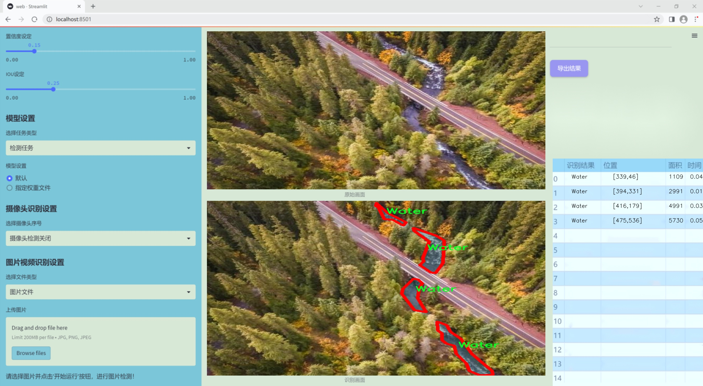
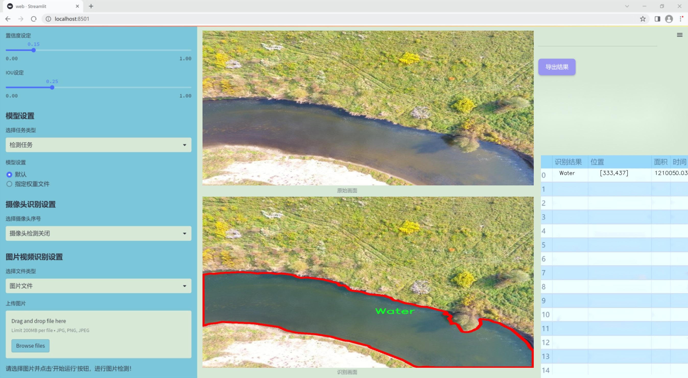
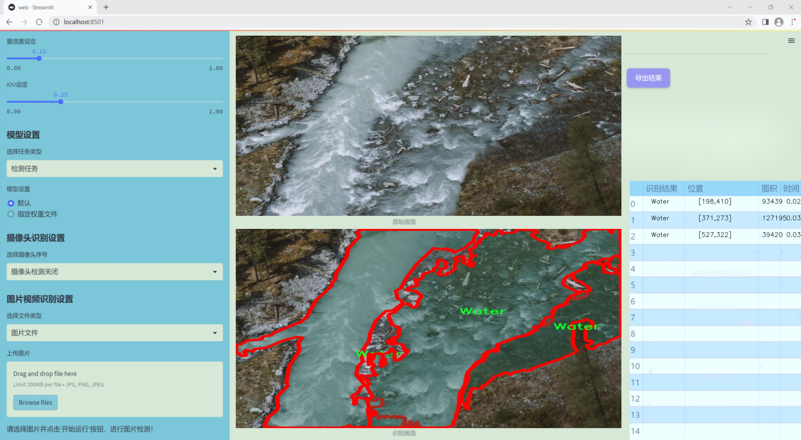
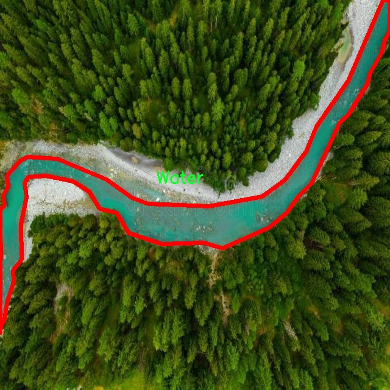
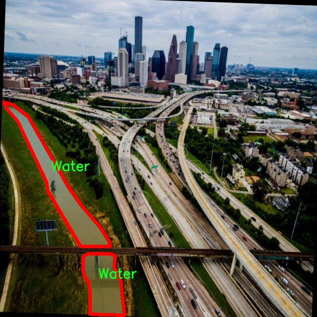
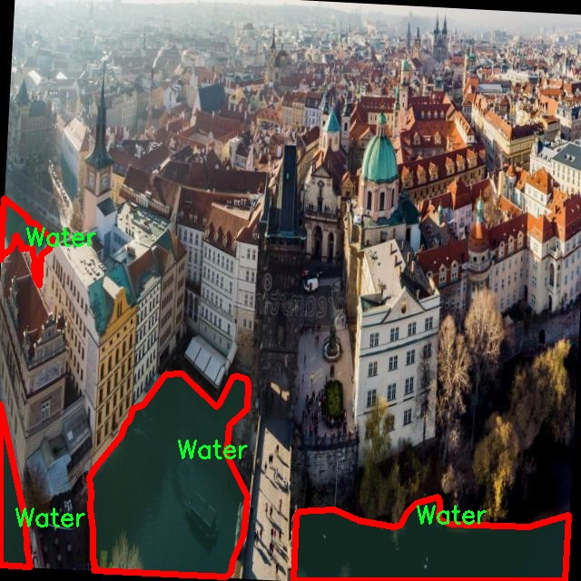

### 1.背景意义

研究背景与意义

随着城市化进程的加快和人类活动的增加，水体污染和水资源管理问题日益凸显。水体作为生态系统的重要组成部分，不仅为生物提供栖息地，还在调节气候、提供饮用水和支持农业等方面发挥着重要作用。因此，及时、准确地监测水体的变化对于环境保护和资源管理至关重要。传统的水体检测方法往往依赖于人工巡查，效率低下且容易受到人为因素的影响。近年来，随着遥感技术和计算机视觉的迅速发展，基于图像处理的水体检测方法逐渐成为研究热点。

本研究旨在基于改进的YOLOv11模型，构建一个高效的航拍水体检测图像分割系统。YOLO（You Only Look Once）系列模型以其快速的检测速度和较高的准确率而闻名，适合实时监测应用。通过对YOLOv11进行改进，我们希望在保证检测精度的同时，提升其在复杂环境下的鲁棒性和适应性。此外，针对特定的水体检测任务，我们将使用包含1673幅图像的数据集，数据集中仅包含一个类别“Water”，这为模型的训练和评估提供了清晰的目标。

在数据集的处理过程中，我们对图像进行了自动方向调整和统一尺寸处理，以确保模型输入的一致性。这种预处理方式能够有效提高模型的训练效率和检测精度。通过构建该系统，我们期望能够实现对水体的自动化监测，及时发现水体污染和变化，为环境保护和水资源管理提供科学依据。

综上所述，本研究不仅具有重要的理论意义，还将为实际应用提供有效的技术支持，推动水体监测技术的发展，助力可持续发展目标的实现。

### 2.视频效果

[2.1 视频效果](https://www.bilibili.com/video/BV1U7SMYTEoq/)

### 3.图片效果







##### [项目涉及的源码数据来源链接](https://kdocs.cn/l/cszuIiCKVNis)**

注意：本项目提供训练的数据集和训练教程,由于版本持续更新,暂不提供权重文件（best.pt）,请按照6.训练教程进行训练后实现上图演示的效果。

### 4.数据集信息

##### 4.1 本项目数据集类别数＆类别名

nc: 1
names: ['Water']


该项目为【图像分割】数据集，请在【训练教程和Web端加载模型教程（第三步）】这一步的时候按照【图像分割】部分的教程来训练

##### 4.2 本项目数据集信息介绍

本项目数据集信息介绍

本项目所使用的数据集专注于航拍水体的检测与图像分割，旨在为改进YOLOv11模型提供高质量的训练素材。数据集的主题为“Water_Bodies”，主要涵盖了水体的多样性及其在不同环境条件下的表现。该数据集包含一个类别，即“Water”，这意味着所有的标注图像均围绕水体的特征展开，旨在提高模型对水体的识别精度和分割能力。

在数据集的构建过程中，我们精心挑选了来自不同地理位置和气候条件的航拍图像，以确保数据的多样性和代表性。这些图像不仅包括静态水体，如湖泊、河流和水库，还涵盖了动态水体的变化，如潮汐影响下的海洋区域。每张图像都经过严格的标注，确保水体区域的准确性，以便为YOLOv11模型的训练提供可靠的输入。

此外，数据集还考虑了不同的光照条件和季节变化，确保模型在各种环境下的鲁棒性。例如，数据集中包含了晴天、阴天、黄昏等不同光照条件下的水体图像，增强了模型对光照变化的适应能力。同时，季节性变化也被纳入考虑，春夏秋冬不同季节的水体表现为模型提供了丰富的训练样本。

通过这种精心设计的数据集，我们期望能够显著提升YOLOv11在航拍水体检测与图像分割任务中的表现，使其能够在实际应用中更好地识别和分割水体区域，从而为环境监测、水资源管理及相关领域提供强有力的技术支持。









### 5.全套项目环境部署视频教程（零基础手把手教学）

[5.1 所需软件PyCharm和Anaconda安装教程（第一步）](https://www.bilibili.com/video/BV1BoC1YCEKi/?spm_id_from=333.999.0.0&vd_source=bc9aec86d164b67a7004b996143742dc)


[5.2 安装Python虚拟环境创建和依赖库安装视频教程（第二步）](https://www.bilibili.com/video/BV1ZoC1YCEBw?spm_id_from=333.788.videopod.sections&vd_source=bc9aec86d164b67a7004b996143742dc)

### 6.改进YOLOv11训练教程和Web_UI前端加载模型教程（零基础手把手教学）

[6.1 改进YOLOv11训练教程和Web_UI前端加载模型教程（第三步）](https://www.bilibili.com/video/BV1BoC1YCEhR?spm_id_from=333.788.videopod.sections&vd_source=bc9aec86d164b67a7004b996143742dc)


按照上面的训练视频教程链接加载项目提供的数据集，运行train.py即可开始训练



     Epoch   gpu_mem       box       obj       cls    labels  img_size
     1/200     20.8G   0.01576   0.01955  0.007536        22      1280: 100%|██████████| 849/849 [14:42<00:00,  1.04s/it]
               Class     Images     Labels          P          R     mAP@.5 mAP@.5:.95: 100%|██████████| 213/213 [01:14<00:00,  2.87it/s]
                 all       3395      17314      0.994      0.957      0.0957      0.0843

     Epoch   gpu_mem       box       obj       cls    labels  img_size
     2/200     20.8G   0.01578   0.01923  0.007006        22      1280: 100%|██████████| 849/849 [14:44<00:00,  1.04s/it]
               Class     Images     Labels          P          R     mAP@.5 mAP@.5:.95: 100%|██████████| 213/213 [01:12<00:00,  2.95it/s]
                 all       3395      17314      0.996      0.956      0.0957      0.0845

     Epoch   gpu_mem       box       obj       cls    labels  img_size
     3/200     20.8G   0.01561    0.0191  0.006895        27      1280: 100%|██████████| 849/849 [10:56<00:00,  1.29it/s]
               Class     Images     Labels          P          R     mAP@.5 mAP@.5:.95: 100%|███████   | 187/213 [00:52<00:00,  4.04it/s]
                 all       3395      17314      0.996      0.957      0.0957      0.0845


###### [项目数据集下载链接](https://kdocs.cn/l/cszuIiCKVNis)

### 7.原始YOLOv11算法讲解

YOLO11采用改进的骨干和颈部架构，增强了特征提取能力，提高了物体检测的精确度和复杂任务的表现。YOLO11引入精炼的架构设计和优化的训练流程，实现更快的处理速度，同时保持精度和性能之间的最佳平衡。通过模型设计的进步，YOLO11m在COCO数据集上实现了更高的均值平均精度（mAP），同时使用比YOLOv8m少22%的参数，使其在不妥协准确性的情况下更加计算高效。YOLO11可以无缝部署在各种环境中，包括边缘设备、云平台以及支持NVIDIA
GPU的系统，确保最大灵活性。无论是物体检测、实例分割、图像分类、姿态估计，还是定向物体检测（OBB），YOLO11都旨在应对多样的计算机视觉挑战。


##### **Ultralytics YOLO11相比于之前版本的主要改进有哪些？**

Ultralytics YOLO11在其前身基础上引入了几项重要进步。主要改进包括：

  1. **增强的特征提取** ：YOLO11采用改进的骨干和颈部架构，增强了特征提取能力，提高了物体检测的精确度。
  2.  **优化的效率和速度** ：精炼的架构设计和优化的训练流程实现了更快的处理速度，同时保持了准确性和性能之间的平衡。
  3.  **更高的准确性与更少的参数** ：YOLO11m在COCO数据集上实现了更高的均值平均精度（mAP），同时使用比YOLOv8m少22%的参数，使其在不妥协准确性的情况下更加计算高效。
  4.  **环境适应性强** ：YOLO11可以在多种环境中部署，包括边缘设备、云平台以及支持NVIDIA GPU的系统。
  5.  **支持广泛的任务** ：YOLO11支持多种计算机视觉任务，如物体检测、实例分割、图像分类、姿态估计和定向物体检测（OBB）。

我们先来看一下其网络结构有什么变化，可以看出，相比较于YOLOv8模型，其将CF2模块改成C3K2，同时在SPPF模块后面添加了一个C2PSA模块，且将YOLOv10的head思想引入到YOLO11的head中，使用深度可分离的方法，减少冗余计算，提高效率。下面我们来详细看一下这两个模块的结构是怎么构成的，以及它们为什么要这样设计


##### C3K2的网络结构

从下面图中我们可以看到，C3K2模块其实就是C2F模块转变出来的，它代码中有一个设置，就是当c3k这个参数为FALSE的时候，C3K2模块就是C2F模块，也就是说它的Bottleneck是普通的Bottleneck；反之当它为true的时候，将Bottleneck模块替换成C3模块。


##### C2PSA的网络结构

` `C2PSA是对 `C2f` 模块的扩展，它结合了PSA(Pointwise Spatial
Attention)块，用于增强特征提取和注意力机制。通过在标准 `C2f` 模块中引入 PSA
块，C2PSA实现了更强大的注意力机制，从而提高了模型对重要特征的捕捉能力。


##### **C2f 模块回顾：**

**** C2f模块是一个更快的 CSP（Cross Stage Partial）瓶颈实现，它通过两个卷积层和多个 Bottleneck
块进行特征提取。相比传统的 CSPNet，C2f 优化了瓶颈层的结构，使得计算速度更快。在 C2f中，`cv1` 是第一个 1x1
卷积，用于减少通道数；`cv2` 是另一个 1x1 卷积，用于恢复输出通道数。而 `n` 是一个包含 Bottleneck 块的数量，用于提取特征。

##### **C2PSA 模块的增强** ：

**C2PSA** 扩展了 C2f，通过引入PSA( **Position-Sensitive Attention)**
，旨在通过多头注意力机制和前馈神经网络来增强特征提取能力。它可以选择性地添加残差结构（shortcut）以优化梯度传播和网络训练效果。同时，使用FFN
可以将输入特征映射到更高维的空间，捕获输入特征的复杂非线性关系，允许模型学习更丰富的特征表示。

##### head部分

YOLO11在head部分的cls分支上使用深度可分离卷积 ，具体代码如下，cv2边界框回归分支，cv3分类分支。

    
    
     self.cv2 = nn.ModuleList(
                nn.Sequential(Conv(x, c2, 3), Conv(c2, c2, 3), nn.Conv2d(c2, 4 * self.reg_max, 1)) for x in ch
            )
            self.cv3 = nn.ModuleList(
                nn.Sequential(
                    nn.Sequential(DWConv(x, x, 3), Conv(x, c3, 1)),
                    nn.Sequential(DWConv(c3, c3, 3), Conv(c3, c3, 1)),
                    nn.Conv2d(c3, self.nc, 1),
                )
                for x in ch
            )


### 8.200+种全套改进YOLOV11创新点原理讲解

#### 8.1 200+种全套改进YOLOV11创新点原理讲解大全

由于篇幅限制，每个创新点的具体原理讲解就不全部展开，具体见下列网址中的改进模块对应项目的技术原理博客网址【Blog】（创新点均为模块化搭建，原理适配YOLOv5~YOLOv11等各种版本）

[改进模块技术原理博客【Blog】网址链接](https://gitee.com/qunmasj/good)


#### 8.2 精选部分改进YOLOV11创新点原理讲解

###### 这里节选部分改进创新点展开原理讲解(完整的改进原理见上图和[改进模块技术原理博客链接](https://gitee.com/qunmasj/good)【如果此小节的图加载失败可以通过CSDN或者Github搜索该博客的标题访问原始博客，原始博客图片显示正常】

### 高效网络架构 CloAtt简介
众所周知，自从 ViTs 提出后，Transformer 基本横扫各大 CV 主流任务，包括视觉识别、目标检测和语义分割等。然而，一个比较棘手的问题就是这个架构参数量和计算量太大，所以一直被广受诟病。因此，后续有不少工作都是朝着这个方向去改进，例如 Swin-Transformer 在局部非重叠窗口中进行注意力计算，而 PVT 中则是使用平均池化来合并 token 以进一步压缩耗时。然而，这些 ViTs 由于其参数量太大以及高 FLOPs 并不适合部署到移动设备。如果我们直接缩小到适合移动设备的尺寸时，它们的性能又会显著降低。


#### MobileViT
因此，出现了不少工作聚焦于探索轻量级的视觉变换器，使 ViTs 适用于移动设备，CVHub 此前也介绍过不少的工作，大家有兴趣可以翻阅历史文章读读。例如，苹果团队提出的 MobileViT 研究了如何将 CNN 与 Transformer 相结合，而另一个工作 MobileFormer 则将轻量级的 MobileNet 与 Transformer 进行融合。此外，最新提出的 EdgeViT 提出了一个局部-全局-局部模块来聚合信息。以上工作的目标都是设计具有高性能、较少参数和低 FLOPs 的移动端友好型模型。


#### EdgeViT
然而，作者从频域编码的角度认为，在现有的轻量级模型中，大多数方法只关注设计稀疏注意力，以有效地处理低频全局信息，而使用相对简单的方法处理高频局部信息。具体而言，大多数模型如 EdgeViT 和 MobileViT，只是简单使用原始卷积提取局部表示，这些方法仅使用卷积中的全局共享权重处理高频本地信息。其他方法，如 LVT ，则是首先将标记展开到窗口中，然后使用窗口内的注意力获得高频信息。这些方法仅使用特定于每个 Token 的上下文感知权重进行局部感知。


#### LVT
虽然上述轻量级模型在多个数据集上取得了良好的结果，但没有一种方法尝试设计更有效的方法，即利用共享和上下文感知权重的优势来处理高频局部信息。基于共享权重的方法，如传统的卷积神经网络，具有平移等变性的特征。与它们不同，基于上下文感知权重的方法，如 LVT 和 NAT，具有可以随输入内容变化的权重。这两种类型的权重在局部感知中都有自己的优势。
#### NAT


受该博客的启发，本文设计了一种轻量级视觉变换器——CloAtt，其利用了上下文感知的局部增强。特别地，CloAtt 采用了双分支设计结构。
#### 局部分支
在局部分支中，本文引入了一个精心设计的 AttnConv，一种简单而有效的卷积操作符，它采用了注意力机制的风格。所提出的 AttnConv 有效地融合了共享权重和上下文感知权重，以聚合高频的局部信息。具体地，AttnConv 首先使用深度卷积（DWconv）提取局部表示，其中 DWconv 具有共享权重。然后，其使用上下文感知权重来增强局部特征。与 Non-Local 等生成上下文感知权重的方法不同，AttnConv 使用门控机制生成上下文感知权重，引入了比常用的注意力机制更强的非线性。此外，AttnConv 将卷积算子应用于 Query 和 Key 以聚合局部信息，然后计算 Q 和 K 的哈达玛积，并对结果进行一系列线性或非线性变换，生成范围在 [-1,1] 之间的上下文感知权重。值得注意的是，AttnConv 继承了卷积的平移等变性，因为它的所有操作都基于卷积。
#### 全局分支
在全局分支中则使用了传统的注意力机制，但对 K 和 V 进行了下采样以减少计算量，从而捕捉低频全局信息。最后，CloFormer 通过简单的方法将局部分支和全局分支的输出进行融合，从而使模型能够同时捕捉高频和低频信息。总的来说，CloFormer 的设计能够同时发挥共享权重和上下文感知权重的优势，提高其局部感知的能力，使其在图像分类、物体检测和语义分割等多个视觉任务上均取得了优异的性能。
如上图2所示，CloFormer 共包含一个卷积主干和四个 stage，每个 stage you Clo 模块 和 ConvFFN 组合而成的模块堆叠而成 。具体得，首先将输入图像通过卷积主干传递，以获取 token 表示。该主干由四个卷积组成，每个卷积的步长依次为2、2、1和1。接下来，tokens 经历四个 Clo 块和 ConvFFN 阶段，以提取分层特征。最后，再利用全局平均池化和全连接层生成预测结果。可以看出，整个架构非常简洁，支持即插即用！


#### ConvFFN
为了将局部信息融入 FFN 过程中，本文采用 ConvFFN 替换了常用的 FFN。ConvFFN 和常用的 FFN 的主要区别在于，ConvFFN 在 GELU 激活函数之后使用了深度卷积（DWconv），从而使 ConvFFN 能够聚合局部信息。由于DWconv 的存在，可以直接在 ConvFFN 中进行下采样而不需要引入 PatchMerge 模块。CloFormer 使用了两种ConvFFN。第一种是在阶段内的 ConvFFN，它直接利用跳跃连接。另一种是连接两个阶段的 ConvFFN，主要用于下采样操作。
#### Clo block
CloFormer 中的 Clo块 是非常关键的组件。每个 Clo 块由一个局部分支和一个全局分支组成。在全局分支中，我们首先下采样 K 和 V，然后对 Q、K 和 V 进行标准的 attention 操作，以提取低频全局信息。
虽然全局分支的设计能够有效减少注意力机制所需的浮点运算次数，并且能够获得全局的感受野。然而，它在处理高频局部信息方面的能力不足。为了解决这个问题，CloFormer 引入了局部分支，并使用 AttnConv 对高频局部信息进行处理。AttnConv 可以融合共享权重和上下文感知权重，能够更好地处理高频局部信息。因此，CloFormer 结合了全局和局部的优势来提高图像分类性能。下面我们重点讲下 AttnConv 。
#### AttnConv
AttnConv 是一个关键模块，使得所提模型能够获得高性能。它结合了一些标准的 attention 操作。具体而言，在AttnConv 中，我们首先进行线性变换以获得 Q、K和V。在进行线性变换之后，我们再对 V 进行共享权重的局部特征聚合。然后，基于处理后的 V 和 Q ，K 进行上下文感知的局部增强。具体流程可对照流程图理解，我们可以将其拆解成三个步骤。
#### Local Feature Aggregation
为了简单起见，本文直接使用一个简单的深度卷积（DWconv）来对 V 进行局部信息聚合。
#### Context-aware Local Enhancement
在将具有共享权重的局部信息整合到 V 中后，我们结合 Q 和 K 生成上下文感知权重。值得注意的是，我们使用了与局部自注意力不同的方法，该方法更加简洁。具体而言，我们首先使用两个 DWconv 对 Q 和 K 分别进行局部信息聚合。然后，我们计算 Q 和 K 的 Hadamard 乘积，并对结果进行一系列转换，以获取在 -1 到 1 之间的上下文感知权重。最后，我们使用生成的权重来增强局部特征。
#### Fusion with Global Branch
在整个 CloFormer 中，我们使用一种简单直接的方法来将局部分支和全局分支的输出进行融合。具体而言，本文是通过将这两个输出在通道维度上进行直接拼接，然后再通过一个 FC 层聚合这些特征并结合残差输出。
最后，上图展示了三种不同的方法。相比于传统卷积，AttnConv 中的上下文感知权重使得模型能够更好地适应输入内容。相比于局部自注意力机制，引入共享权重使得模型能够更好地处理高频信息，从而提高性能。此外，生成上下文感知权重的方法引入了更强的非线性性，也提高了性能。需要注意的是，AttnConv 中的所有操作都基于卷积，保持了卷积的平移等变性特性。


### 9.系统功能展示

图9.1.系统支持检测结果表格显示

  图9.2.系统支持置信度和IOU阈值手动调节

  图9.3.系统支持自定义加载权重文件best.pt(需要你通过步骤5中训练获得)

  图9.4.系统支持摄像头实时识别

  图9.5.系统支持图片识别

  图9.6.系统支持视频识别

  图9.7.系统支持识别结果文件自动保存

  图9.8.系统支持Excel导出检测结果数据


### 10. YOLOv11核心改进源码讲解

#### 10.1 UniRepLKNet.py

以下是对给定代码的核心部分进行分析和详细注释的结果。我们将保留主要的类和函数，删除冗余的部分，并添加中文注释以帮助理解。

```python
import torch
import torch.nn as nn
import torch.nn.functional as F
from timm.layers import trunc_normal_, DropPath, to_2tuple

class GRNwithNHWC(nn.Module):
    """ 
    GRN (Global Response Normalization) 层
    该层在 ConvNeXt V2 中首次提出，主要用于归一化特征图。
    输入假设为 (N, H, W, C) 格式。
    """
    def __init__(self, dim, use_bias=True):
        super().__init__()
        self.use_bias = use_bias
        self.gamma = nn.Parameter(torch.zeros(1, 1, 1, dim))  # 学习参数 gamma
        if self.use_bias:
            self.beta = nn.Parameter(torch.zeros(1, 1, 1, dim))  # 学习参数 beta

    def forward(self, x):
        Gx = torch.norm(x, p=2, dim=(1, 2), keepdim=True)  # 计算 L2 范数
        Nx = Gx / (Gx.mean(dim=-1, keepdim=True) + 1e-6)  # 归一化
        if self.use_bias:
            return (self.gamma * Nx + 1) * x + self.beta  # 应用归一化和偏置
        else:
            return (self.gamma * Nx + 1) * x  # 应用归一化

class DilatedReparamBlock(nn.Module):
    """
    Dilated Reparam Block，采用膨胀卷积以提高感受野。
    输入假设为 (N, C, H, W) 格式。
    """
    def __init__(self, channels, kernel_size, deploy, use_sync_bn=False):
        super().__init__()
        self.lk_origin = nn.Conv2d(channels, channels, kernel_size=kernel_size, stride=1,
                                    padding=kernel_size//2, dilation=1, groups=channels, bias=True)

        # 根据 kernel_size 设置不同的膨胀卷积参数
        if kernel_size == 17:
            self.kernel_sizes = [5, 9, 3, 3, 3]
            self.dilates = [1, 2, 4, 5, 7]
        # 其他情况省略...

        if not deploy:
            self.origin_bn = nn.BatchNorm2d(channels)  # 使用批归一化

            # 创建膨胀卷积和对应的批归一化层
            for k, r in zip(self.kernel_sizes, self.dilates):
                self.__setattr__('dil_conv_k{}_{}'.format(k, r),
                                 nn.Conv2d(in_channels=channels, out_channels=channels, kernel_size=k, stride=1,
                                           padding=(r * (k - 1) + 1) // 2, dilation=r, groups=channels,
                                           bias=False))
                self.__setattr__('dil_bn_k{}_{}'.format(k, r), nn.BatchNorm2d(channels))

    def forward(self, x):
        out = self.lk_origin(x)  # 先通过原始卷积
        if hasattr(self, 'origin_bn'):
            out = self.origin_bn(out)  # 如果不是部署模式，则应用批归一化
        # 应用膨胀卷积
        for k, r in zip(self.kernel_sizes, self.dilates):
            conv = self.__getattr__('dil_conv_k{}_{}'.format(k, r))
            bn = self.__getattr__('dil_bn_k{}_{}'.format(k, r))
            out += bn(conv(x))
        return out

class UniRepLKNetBlock(nn.Module):
    """
    UniRepLKNet 的基本构建块，包含卷积、归一化和激活层。
    """
    def __init__(self, dim, kernel_size, drop_path=0., deploy=False):
        super().__init__()
        self.dwconv = DilatedReparamBlock(dim, kernel_size, deploy=deploy)  # 膨胀卷积
        self.norm = nn.BatchNorm2d(dim)  # 批归一化
        self.se = SEBlock(dim, dim // 4)  # Squeeze-and-Excitation Block

        ffn_dim = dim * 4  # 前馈网络维度
        self.pwconv1 = nn.Linear(dim, ffn_dim)  # 第一层前馈网络
        self.act = nn.GELU()  # 激活函数
        self.pwconv2 = nn.Linear(ffn_dim, dim)  # 第二层前馈网络

    def forward(self, inputs):
        y = self.se(self.norm(self.dwconv(inputs)))  # 先通过膨胀卷积和归一化，再通过 SE Block
        y = self.pwconv2(self.act(self.pwconv1(y)))  # 前馈网络
        return y + inputs  # 残差连接

class UniRepLKNet(nn.Module):
    """
    UniRepLKNet 模型，集成多个 UniRepLKNetBlock。
    """
    def __init__(self, in_chans=3, num_classes=1000, depths=(3, 3, 27, 3), dims=(96, 192, 384, 768)):
        super().__init__()
        self.downsample_layers = nn.ModuleList()  # 下采样层
        self.stages = nn.ModuleList()  # 主体阶段

        # 初始化下采样层
        self.downsample_layers.append(nn.Conv2d(in_chans, dims[0] // 2, kernel_size=3, stride=2, padding=1))
        for i in range(3):
            self.downsample_layers.append(nn.Conv2d(dims[i], dims[i + 1], kernel_size=3, stride=2, padding=1))

        # 初始化各个阶段的 UniRepLKNetBlock
        for i in range(4):
            main_stage = nn.Sequential(
                *[UniRepLKNetBlock(dim=dims[i], kernel_size=3) for _ in range(depths[i])])
            self.stages.append(main_stage)

    def forward(self, x):
        for stage in self.downsample_layers:
            x = stage(x)  # 通过下采样层
        for stage in self.stages:
            x = stage(x)  # 通过各个阶段的块
        return x

# 示例用法
if __name__ == '__main__':
    inputs = torch.randn((1, 3, 640, 640))  # 随机输入
    model = UniRepLKNet()  # 实例化模型
    res = model(inputs)  # 前向传播
    print(res.shape)  # 输出结果的形状
```

### 代码分析
1. **GRNwithNHWC**: 实现了全局响应归一化，增强了特征的表达能力。
2. **DilatedReparamBlock**: 通过膨胀卷积提高感受野，适用于多种卷积核大小。
3. **UniRepLKNetBlock**: 组合了卷积、归一化和激活函数，形成一个基本的构建块。
4. **UniRepLKNet**: 整个模型的框架，包含下采样层和多个阶段，最终实现特征提取。

### 总结
上述代码实现了一个复杂的卷积神经网络结构，适用于多种视觉任务。通过模块化设计，便于扩展和修改。

这个文件实现了一个名为UniRepLKNet的深度学习模型，主要用于音频、视频、点云、时间序列和图像识别。它是基于多个现有模型（如RepLKNet、ConvNeXt、DINO和DeiT）构建的，具有较大的卷积核和高效的特征提取能力。

文件首先导入了必要的库，包括PyTorch和一些自定义的模块。接着定义了一些基本的模块，例如GRN（全局响应归一化）层、NCHW到NHWC的转换层等。这些模块用于处理输入数据的格式和进行归一化操作。

在模型的核心部分，定义了一个名为DilatedReparamBlock的模块，它结合了扩张卷积和重参数化技术，以提高模型的表现。该模块根据不同的卷积核大小和扩张率，使用多个卷积层来提取特征。

UniRepLKNetBlock是模型的基本构建块，包含了深度卷积、归一化、Squeeze-and-Excitation（SE）块和前馈网络。它使用了可选的DropPath技术来增强模型的鲁棒性。

UniRepLKNet类是整个模型的实现，它包含了多个阶段的卷积块和下采样层。模型的输入通道数、类别数、每个阶段的深度和特征维度都可以通过参数进行配置。模型在初始化时会根据给定的深度设置默认的卷积核大小。

模型的前向传播方法支持两种输出模式：'logits'和'features'，分别用于返回分类结果和特征图。模型还支持通过`switch_to_deploy`方法切换到推理模式，以提高推理效率。

文件的最后部分定义了一些函数，用于创建不同版本的UniRepLKNet模型（如unireplknet_a、unireplknet_f等），并提供了加载预训练权重的功能。通过这些函数，用户可以方便地实例化模型并进行训练或推理。

整体来看，这个文件实现了一个灵活且高效的深度学习模型，适用于多种视觉和音频任务，具备较强的特征提取能力和扩展性。

#### 10.2 CTrans.py

以下是经过简化和注释的核心代码部分，主要保留了 `ChannelTransformer` 及其相关的嵌入、重构和编码模块。

```python
import torch
import torch.nn as nn
import numpy as np
from torch.nn import Dropout, LayerNorm

class Channel_Embeddings(nn.Module):
    """通道嵌入类，负责将输入图像划分为补丁并生成位置嵌入。"""
    def __init__(self, patchsize, img_size, in_channels):
        super().__init__()
        # 计算补丁数量
        n_patches = (img_size[0] // patchsize) * (img_size[1] // patchsize)
        # 定义补丁嵌入层
        self.patch_embeddings = nn.Conv2d(in_channels, in_channels, kernel_size=patchsize, stride=patchsize)
        # 定义位置嵌入参数
        self.position_embeddings = nn.Parameter(torch.zeros(1, n_patches, in_channels))
        self.dropout = Dropout(0.1)

    def forward(self, x):
        """前向传播，计算嵌入。"""
        if x is None:
            return None
        # 通过补丁嵌入层处理输入
        x = self.patch_embeddings(x)  # (B, hidden, n_patches^(1/2), n_patches^(1/2))
        x = x.flatten(2).transpose(-1, -2)  # (B, n_patches, hidden)
        embeddings = x + self.position_embeddings  # 添加位置嵌入
        embeddings = self.dropout(embeddings)  # 应用 dropout
        return embeddings

class Reconstruct(nn.Module):
    """重构类，负责将嵌入转换回图像空间。"""
    def __init__(self, in_channels, out_channels, kernel_size, scale_factor):
        super(Reconstruct, self).__init__()
        self.conv = nn.Conv2d(in_channels, out_channels, kernel_size=kernel_size, padding=kernel_size//2)
        self.norm = nn.BatchNorm2d(out_channels)
        self.activation = nn.ReLU(inplace=True)
        self.scale_factor = scale_factor

    def forward(self, x):
        """前向传播，进行重构。"""
        if x is None:
            return None
        B, n_patch, hidden = x.size()  # 获取批量大小、补丁数量和隐藏维度
        h, w = int(np.sqrt(n_patch)), int(np.sqrt(n_patch))  # 计算高度和宽度
        x = x.permute(0, 2, 1).contiguous().view(B, hidden, h, w)  # 重塑为 (B, hidden, h, w)
        x = nn.Upsample(scale_factor=self.scale_factor)(x)  # 上采样
        out = self.conv(x)  # 卷积操作
        out = self.norm(out)  # 归一化
        out = self.activation(out)  # 激活函数
        return out

class Encoder(nn.Module):
    """编码器类，包含多个编码块。"""
    def __init__(self, channel_num):
        super(Encoder, self).__init__()
        self.layer = nn.ModuleList()
        for _ in range(1):  # 这里只添加一个编码块
            layer = Block_ViT(channel_num)
            self.layer.append(layer)

    def forward(self, emb1, emb2, emb3, emb4):
        """前向传播，依次通过每个编码块。"""
        for layer_block in self.layer:
            emb1, emb2, emb3, emb4 = layer_block(emb1, emb2, emb3, emb4)
        return emb1, emb2, emb3, emb4

class ChannelTransformer(nn.Module):
    """通道变换器类，负责整个模型的构建和前向传播。"""
    def __init__(self, channel_num=[64, 128, 256, 512], img_size=640, patchSize=[40, 20, 10, 5]):
        super().__init__()
        # 初始化嵌入层
        self.embeddings_1 = Channel_Embeddings(patchSize[0], img_size // 8, channel_num[0])
        self.embeddings_2 = Channel_Embeddings(patchSize[1], img_size // 16, channel_num[1])
        self.embeddings_3 = Channel_Embeddings(patchSize[2], img_size // 32, channel_num[2])
        self.embeddings_4 = Channel_Embeddings(patchSize[3], img_size // 64, channel_num[3])
        self.encoder = Encoder(channel_num)

        # 初始化重构层
        self.reconstruct_1 = Reconstruct(channel_num[0], channel_num[0], kernel_size=1, scale_factor=(patchSize[0], patchSize[0]))
        self.reconstruct_2 = Reconstruct(channel_num[1], channel_num[1], kernel_size=1, scale_factor=(patchSize[1], patchSize[1]))
        self.reconstruct_3 = Reconstruct(channel_num[2], channel_num[2], kernel_size=1, scale_factor=(patchSize[2], patchSize[2]))
        self.reconstruct_4 = Reconstruct(channel_num[3], channel_num[3], kernel_size=1, scale_factor=(patchSize[3], patchSize[3]))

    def forward(self, en):
        """前向传播，计算嵌入、编码和重构。"""
        en1, en2, en3, en4 = en if len(en) == 4 else (en[0], en[1], en[2], None)
        
        # 计算嵌入
        emb1 = self.embeddings_1(en1) if en1 is not None else None
        emb2 = self.embeddings_2(en2) if en2 is not None else None
        emb3 = self.embeddings_3(en3) if en3 is not None else None
        emb4 = self.embeddings_4(en4) if en4 is not None else None

        # 编码
        encoded1, encoded2, encoded3, encoded4 = self.encoder(emb1, emb2, emb3, emb4)

        # 重构
        x1 = self.reconstruct_1(encoded1) + en1 if en1 is not None else None
        x2 = self.reconstruct_2(encoded2) + en2 if en2 is not None else None
        x3 = self.reconstruct_3(encoded3) + en3 if en3 is not None else None
        x4 = self.reconstruct_4(encoded4) + en4 if en4 is not None else None

        return [x1, x2, x3, x4]
```

### 代码注释说明
1. **Channel_Embeddings**: 该类负责将输入图像划分为补丁，并生成对应的嵌入。它使用卷积层进行补丁嵌入，并添加位置嵌入以保留空间信息。
2. **Reconstruct**: 该类负责将编码后的嵌入重构回图像空间，使用卷积和上采样操作。
3. **Encoder**: 该类由多个编码块组成，负责对嵌入进行编码处理。
4. **ChannelTransformer**: 该类是整个模型的核心，负责初始化嵌入层、编码器和重构层，并实现前向传播逻辑。

以上代码保留了模型的主要结构和功能，同时添加了详细的中文注释以帮助理解。

这个程序文件 `CTrans.py` 实现了一个基于通道的变换器（Channel Transformer），主要用于图像处理任务。代码中定义了多个类，每个类负责不同的功能，下面是对这些类及其功能的详细说明。

首先，`Channel_Embeddings` 类用于构建图像的嵌入表示。它通过最大池化和卷积操作将输入图像分割成多个补丁，并为每个补丁生成位置嵌入。位置嵌入是通过一个可学习的参数实现的。该类的 `forward` 方法接收输入图像，经过处理后返回嵌入表示。

接下来是 `Reconstruct` 类，它的作用是将经过编码的特征图重建为更高分辨率的图像。该类使用卷积层、批归一化和激活函数（ReLU）来处理输入，并通过上采样将特征图的尺寸扩大。

`Attention_org` 类实现了多头自注意力机制。它接受多个嵌入作为输入，计算每个嵌入的查询、键和值，并通过注意力机制计算上下文信息。该类还包含了对注意力权重的可视化选项。

`Mlp` 类是一个简单的多层感知机（MLP），包含两个全连接层和一个激活函数（GELU）。它用于对输入进行非线性变换，并具有权重初始化的功能。

`Block_ViT` 类是变换器的基本构建块，包含自注意力机制和前馈网络。它首先对输入进行层归一化，然后通过注意力层和前馈网络进行处理，最后将结果与输入相加以实现残差连接。

`Encoder` 类由多个 `Block_ViT` 组成，负责对输入的嵌入进行编码。它对每个嵌入进行归一化处理，并通过多个编码块进行特征提取。

`ChannelTransformer` 类是整个模型的核心，负责将输入图像分成多个通道，并通过嵌入、编码和重建过程生成输出。它初始化了多个嵌入层、编码器和重建层，并在 `forward` 方法中将输入数据传递给这些层进行处理。

最后，`GetIndexOutput` 类用于从模型的输出中提取特定索引的结果，便于后续处理。

整体来看，这个程序实现了一个复杂的深度学习模型，结合了卷积、注意力机制和多层感知机，适用于图像的特征提取和重建任务。每个类的设计都遵循了模块化的原则，使得代码结构清晰，易于维护和扩展。

#### 10.3 attention.py

以下是经过简化和注释的核心代码部分：

```python
import torch
from torch import nn

class EMA(nn.Module):
    """ 
    指数移动平均 (Exponential Moving Average) 模块 
    用于增强特征的表示能力。
    """
    def __init__(self, channels, factor=8):
        super(EMA, self).__init__()
        self.groups = factor  # 将通道分成若干组
        assert channels // self.groups > 0  # 确保每组至少有一个通道
        self.softmax = nn.Softmax(-1)  # Softmax层
        self.agp = nn.AdaptiveAvgPool2d((1, 1))  # 自适应平均池化
        self.pool_h = nn.AdaptiveAvgPool2d((None, 1))  # 对高度进行池化
        self.pool_w = nn.AdaptiveAvgPool2d((1, None))  # 对宽度进行池化
        self.gn = nn.GroupNorm(channels // self.groups, channels // self.groups)  # 组归一化
        self.conv1x1 = nn.Conv2d(channels // self.groups, channels // self.groups, kernel_size=1)  # 1x1卷积
        self.conv3x3 = nn.Conv2d(channels // self.groups, channels // self.groups, kernel_size=3, padding=1)  # 3x3卷积

    def forward(self, x):
        b, c, h, w = x.size()  # 获取输入的尺寸
        group_x = x.reshape(b * self.groups, -1, h, w)  # 将输入重塑为分组形式
        x_h = self.pool_h(group_x)  # 对高度进行池化
        x_w = self.pool_w(group_x).permute(0, 1, 3, 2)  # 对宽度进行池化并转置
        hw = self.conv1x1(torch.cat([x_h, x_w], dim=2))  # 1x1卷积
        x_h, x_w = torch.split(hw, [h, w], dim=2)  # 分割结果
        x1 = self.gn(group_x * x_h.sigmoid() * x_w.permute(0, 1, 3, 2).sigmoid())  # 归一化
        x2 = self.conv3x3(group_x)  # 3x3卷积
        x11 = self.softmax(self.agp(x1).reshape(b * self.groups, -1, 1).permute(0, 2, 1))  # 计算权重
        x12 = x2.reshape(b * self.groups, c // self.groups, -1)  # 重塑
        x21 = self.softmax(self.agp(x2).reshape(b * self.groups, -1, 1).permute(0, 2, 1))  # 计算权重
        x22 = x1.reshape(b * self.groups, c // self.groups, -1)  # 重塑
        weights = (torch.matmul(x11, x12) + torch.matmul(x21, x22)).reshape(b * self.groups, 1, h, w)  # 计算最终权重
        return (group_x * weights.sigmoid()).reshape(b, c, h, w)  # 返回加权后的结果

class SimAM(nn.Module):
    """ 
    SimAM 模块，用于自适应特征增强。
    """
    def __init__(self, e_lambda=1e-4):
        super(SimAM, self).__init__()
        self.activaton = nn.Sigmoid()  # Sigmoid激活函数
        self.e_lambda = e_lambda  # 正则化参数

    def forward(self, x):
        b, c, h, w = x.size()  # 获取输入的尺寸
        n = w * h - 1  # 计算总的像素点数
        x_minus_mu_square = (x - x.mean(dim=[2, 3], keepdim=True)).pow(2)  # 计算均值平方差
        y = x_minus_mu_square / (4 * (x_minus_mu_square.sum(dim=[2, 3], keepdim=True) / n + self.e_lambda)) + 0.5  # 计算y
        return x * self.activaton(y)  # 返回加权后的结果

class SpatialGroupEnhance(nn.Module):
    """ 
    空间组增强模块，用于增强特征的空间表示。
    """
    def __init__(self, groups=8):
        super().__init__()
        self.groups = groups  # 组数
        self.avg_pool = nn.AdaptiveAvgPool2d(1)  # 自适应平均池化
        self.weight = nn.Parameter(torch.zeros(1, groups, 1, 1))  # 权重参数
        self.bias = nn.Parameter(torch.zeros(1, groups, 1, 1))  # 偏置参数
        self.sig = nn.Sigmoid()  # Sigmoid激活函数
        self.init_weights()  # 初始化权重

    def init_weights(self):
        """ 初始化权重 """
        for m in self.modules():
            if isinstance(m, nn.Conv2d):
                nn.init.kaiming_normal_(m.weight, mode='fan_out')  # Kaiming初始化
                if m.bias is not None:
                    nn.init.constant_(m.bias, 0)  # 偏置初始化为0
            elif isinstance(m, nn.BatchNorm2d):
                nn.init.constant_(m.weight, 1)  # 批归一化权重初始化为1
                nn.init.constant_(m.bias, 0)  # 偏置初始化为0
            elif isinstance(m, nn.Linear):
                nn.init.normal_(m.weight, std=0.001)  # 线性层权重初始化
                if m.bias is not None:
                    nn.init.constant_(m.bias, 0)  # 偏置初始化为0

    def forward(self, x):
        b, c, h, w = x.shape  # 获取输入的尺寸
        x = x.view(b * self.groups, -1, h, w)  # 重塑输入
        xn = x * self.avg_pool(x)  # 计算平均池化
        xn = xn.sum(dim=1, keepdim=True)  # 求和
        t = xn.view(b * self.groups, -1)  # 重塑
        t = t - t.mean(dim=1, keepdim=True)  # 减去均值
        std = t.std(dim=1, keepdim=True) + 1e-5  # 计算标准差
        t = t / std  # 归一化
        t = t.view(b, self.groups, h, w)  # 重塑
        t = t * self.weight + self.bias  # 加权
        t = t.view(b * self.groups, 1, h, w)  # 重塑
        x = x * self.sig(t)  # 返回加权后的结果
        return x.view(b, c, h, w)  # 返回最终结果
```

### 代码说明：
1. **EMA (Exponential Moving Average)**: 该模块用于增强特征表示，通过对输入特征进行加权和归一化，提升模型的表现。
2. **SimAM (Similarity Adaptive Module)**: 该模块通过计算输入特征的均值和方差，动态调整特征的权重，增强模型的自适应能力。
3. **SpatialGroupEnhance**: 该模块通过对输入特征进行空间增强，提升特征的空间表示能力，使用自适应平均池化和Sigmoid激活函数来实现。

这个程序文件 `attention.py` 定义了一系列用于深度学习中注意力机制的模块，主要基于 PyTorch 框架。文件中包含了多个类，每个类实现了不同类型的注意力机制或相关功能，以下是对文件内容的详细说明。

首先，文件导入了必要的库，包括 PyTorch 的核心模块和一些其他工具，如 `torchvision` 和 `einops`。这些库提供了张量操作、神经网络层、初始化方法等功能。

接下来，文件定义了一系列注意力模块，包括：

1. **EMA (Exponential Moving Average)**：该模块通过对输入进行分组处理，计算每个组的加权平均，并使用 sigmoid 函数生成权重，从而增强特征的表达能力。

2. **SimAM (Similarity Attention Module)**：这是一个基于相似度的注意力模块，通过计算输入特征的均值和方差来生成注意力权重，强调特征的相似性。

3. **SpatialGroupEnhance**：该模块通过对输入特征进行空间增强，利用自适应平均池化和 sigmoid 激活函数来生成空间注意力权重。

4. **TopkRouting**：实现了可微分的 Top-k 路由机制，选择最相关的特征进行后续处理。

5. **KVGather**：用于根据路由索引和权重选择键值对，支持不同的加权方式（如软加权和硬加权）。

6. **QKVLinear**：用于将输入特征映射到查询、键和值的线性变换。

7. **BiLevelRoutingAttention**：实现了双层路由注意力机制，结合了局部和全局注意力的优势。

8. **LocalWindowAttention**：局部窗口注意力模块，适用于图像处理，利用局部窗口的特征进行注意力计算。

9. **CoordAtt**、**TripletAttention**、**BAMBlock**、**EfficientAttention** 等模块：这些模块实现了不同的注意力机制，增强了模型的特征提取能力。

10. **其他模块**：如 `DeformConv`、`EffectiveSEModule`、`MLCA` 等，提供了不同的卷积和注意力机制，进一步丰富了模型的功能。

文件中还包含了一些辅助函数，如 `img2windows` 和 `windows2img`，用于将图像划分为窗口和将窗口重组为图像。这些函数在处理图像时非常有用，尤其是在实现局部注意力机制时。

总的来说，这个文件实现了多种注意力机制，适用于不同的深度学习任务，尤其是在计算机视觉领域。通过组合这些模块，可以构建出更强大的神经网络模型，以提高特征提取和表示能力。

#### 10.4 lsknet.py

以下是代码中最核心的部分，并附上详细的中文注释：

```python
import torch
import torch.nn as nn
from functools import partial

class Mlp(nn.Module):
    """多层感知机（MLP）模块"""
    def __init__(self, in_features, hidden_features=None, out_features=None, act_layer=nn.GELU, drop=0.):
        super().__init__()
        out_features = out_features or in_features  # 输出特征数，如果未指定则与输入特征数相同
        hidden_features = hidden_features or in_features  # 隐藏层特征数，如果未指定则与输入特征数相同
        self.fc1 = nn.Conv2d(in_features, hidden_features, 1)  # 第一个卷积层
        self.dwconv = DWConv(hidden_features)  # 深度卷积层
        self.act = act_layer()  # 激活函数
        self.fc2 = nn.Conv2d(hidden_features, out_features, 1)  # 第二个卷积层
        self.drop = nn.Dropout(drop)  # Dropout层

    def forward(self, x):
        """前向传播"""
        x = self.fc1(x)  # 通过第一个卷积层
        x = self.dwconv(x)  # 通过深度卷积层
        x = self.act(x)  # 激活
        x = self.drop(x)  # Dropout
        x = self.fc2(x)  # 通过第二个卷积层
        x = self.drop(x)  # Dropout
        return x

class Attention(nn.Module):
    """注意力模块"""
    def __init__(self, d_model):
        super().__init__()
        self.proj_1 = nn.Conv2d(d_model, d_model, 1)  # 投影层1
        self.activation = nn.GELU()  # 激活函数
        self.spatial_gating_unit = LSKblock(d_model)  # 空间门控单元
        self.proj_2 = nn.Conv2d(d_model, d_model, 1)  # 投影层2

    def forward(self, x):
        """前向传播"""
        shortcut = x.clone()  # 保存输入以进行残差连接
        x = self.proj_1(x)  # 通过投影层1
        x = self.activation(x)  # 激活
        x = self.spatial_gating_unit(x)  # 通过空间门控单元
        x = self.proj_2(x)  # 通过投影层2
        x = x + shortcut  # 残差连接
        return x

class Block(nn.Module):
    """基本块，包括注意力和MLP"""
    def __init__(self, dim, mlp_ratio=4., drop=0., drop_path=0., act_layer=nn.GELU):
        super().__init__()
        self.norm1 = nn.BatchNorm2d(dim)  # 第一层归一化
        self.norm2 = nn.BatchNorm2d(dim)  # 第二层归一化
        self.attn = Attention(dim)  # 注意力模块
        self.drop_path = DropPath(drop_path) if drop_path > 0. else nn.Identity()  # 随机深度
        mlp_hidden_dim = int(dim * mlp_ratio)  # MLP隐藏层维度
        self.mlp = Mlp(in_features=dim, hidden_features=mlp_hidden_dim, act_layer=act_layer, drop=drop)  # MLP模块

    def forward(self, x):
        """前向传播"""
        x = x + self.drop_path(self.attn(self.norm1(x)))  # 通过注意力模块并添加残差
        x = x + self.drop_path(self.mlp(self.norm2(x)))  # 通过MLP模块并添加残差
        return x

class LSKNet(nn.Module):
    """LSKNet模型"""
    def __init__(self, img_size=224, in_chans=3, embed_dims=[64, 128, 256, 512], depths=[3, 4, 6, 3]):
        super().__init__()
        self.num_stages = len(depths)  # 网络阶段数
        for i in range(self.num_stages):
            # 初始化每个阶段的嵌入层和块
            patch_embed = OverlapPatchEmbed(img_size=img_size // (2 ** i), in_chans=in_chans if i == 0 else embed_dims[i - 1], embed_dim=embed_dims[i])
            block = nn.ModuleList([Block(dim=embed_dims[i]) for _ in range(depths[i])])  # 生成块
            norm = nn.LayerNorm(embed_dims[i])  # 归一化层
            setattr(self, f"patch_embed{i + 1}", patch_embed)  # 将嵌入层添加到模型中
            setattr(self, f"block{i + 1}", block)  # 将块添加到模型中
            setattr(self, f"norm{i + 1}", norm)  # 将归一化层添加到模型中

    def forward(self, x):
        """前向传播"""
        outs = []
        for i in range(self.num_stages):
            patch_embed = getattr(self, f"patch_embed{i + 1}")  # 获取嵌入层
            block = getattr(self, f"block{i + 1}")  # 获取块
            norm = getattr(self, f"norm{i + 1}")  # 获取归一化层
            x, H, W = patch_embed(x)  # 嵌入
            for blk in block:
                x = blk(x)  # 通过每个块
            x = norm(x)  # 归一化
            outs.append(x)  # 保存输出
        return outs

class DWConv(nn.Module):
    """深度卷积模块"""
    def __init__(self, dim=768):
        super(DWConv, self).__init__()
        self.dwconv = nn.Conv2d(dim, dim, 3, padding=1, groups=dim)  # 深度卷积层

    def forward(self, x):
        """前向传播"""
        return self.dwconv(x)  # 通过深度卷积层

# 生成模型的函数
def lsknet_t(weights=''):
    model = LSKNet(embed_dims=[32, 64, 160, 256], depths=[3, 3, 5, 2])  # 创建LSKNet模型
    if weights:
        model.load_state_dict(torch.load(weights)['state_dict'])  # 加载权重
    return model

# 主程序
if __name__ == '__main__':
    model = lsknet_t('lsk_t_backbone-2ef8a593.pth')  # 创建模型并加载权重
    inputs = torch.randn((1, 3, 640, 640))  # 随机输入
    for i in model(inputs):
        print(i.size())  # 输出每个阶段的输出尺寸
```

### 代码核心部分说明：
1. **Mlp**：实现了一个多层感知机，包含两个卷积层和一个深度卷积层，使用GELU激活函数和Dropout。
2. **Attention**：实现了一个注意力机制，包含两个投影层和一个空间门控单元。
3. **Block**：将注意力模块和MLP结合在一起，形成一个基本的网络块。
4. **LSKNet**：构建整个网络结构，包含多个阶段，每个阶段由嵌入层、多个块和归一化层组成。
5. **DWConv**：实现了深度卷积，用于特征提取。
6. **lsknet_t**：用于创建LSKNet模型并加载预训练权重的函数。

这个程序文件 `lsknet.py` 实现了一个名为 LSKNet 的深度学习模型，主要用于图像处理任务。该模型的结构包括多个模块和层，具体实现了卷积、注意力机制和多层感知机等功能。以下是对代码的详细讲解。

首先，程序导入了必要的库，包括 PyTorch 及其神经网络模块、函数式工具和 NumPy。接着，定义了一个 Mlp 类，这个类实现了一个多层感知机，包含两个卷积层和一个深度卷积层（DWConv），并使用 GELU 激活函数和 Dropout 层来增加模型的非线性和防止过拟合。

接下来是 LSKblock 类，它实现了一个特定的注意力机制。该类使用了多个卷积层，包括深度卷积和空间卷积，通过对输入特征图进行处理，生成注意力权重，并对输入进行加权，增强了模型对重要特征的关注。

Attention 类则封装了 LSKblock，并在其前后添加了线性变换和激活函数。Block 类是模型的基本构建块，结合了归一化、注意力机制和多层感知机，形成了一个完整的处理单元。它还使用了层级缩放参数来增强模型的表达能力。

OverlapPatchEmbed 类负责将输入图像划分为重叠的补丁，并将这些补丁嵌入到一个高维空间中。它使用卷积层来实现这一功能，并在输出后进行归一化处理。

LSKNet 类是整个模型的核心，构造了多个阶段，每个阶段包含了补丁嵌入、多个 Block 和归一化层。模型的深度和宽度可以通过参数进行调整。该类还实现了前向传播方法，处理输入数据并返回每个阶段的输出。

DWConv 类实现了深度卷积操作，进一步增强了模型的特征提取能力。程序中还定义了一个 update_weight 函数，用于更新模型的权重。

最后，提供了两个函数 lsknet_t 和 lsknet_s，用于创建不同配置的 LSKNet 模型，并可选择加载预训练权重。主程序部分创建了一个 LSKNet 模型实例，并对随机生成的输入进行前向传播，输出每个阶段的特征图尺寸。

整体来看，这个程序文件实现了一个灵活且强大的图像处理模型，适用于各种计算机视觉任务。

### 11.完整训练+Web前端界面+200+种全套创新点源码、数据集获取


# [下载链接：https://mbd.pub/o/bread/Z5iZkp9s](https://mbd.pub/o/bread/Z5iZkp9s)